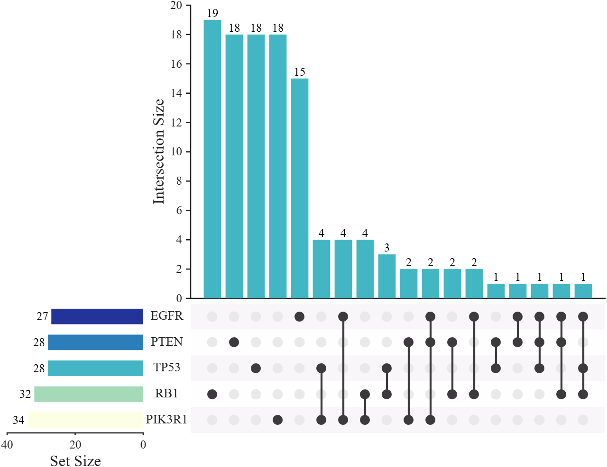
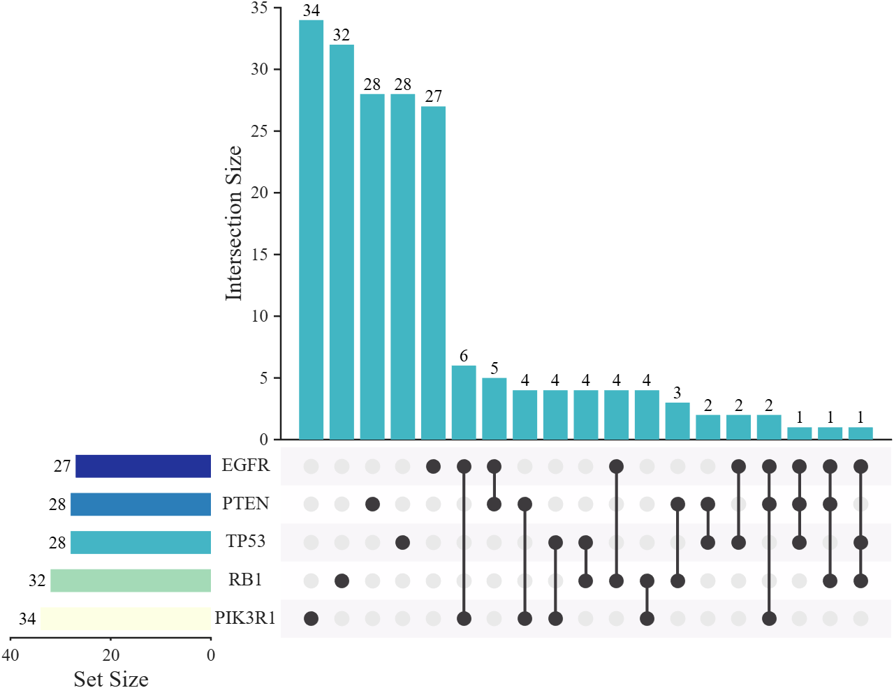
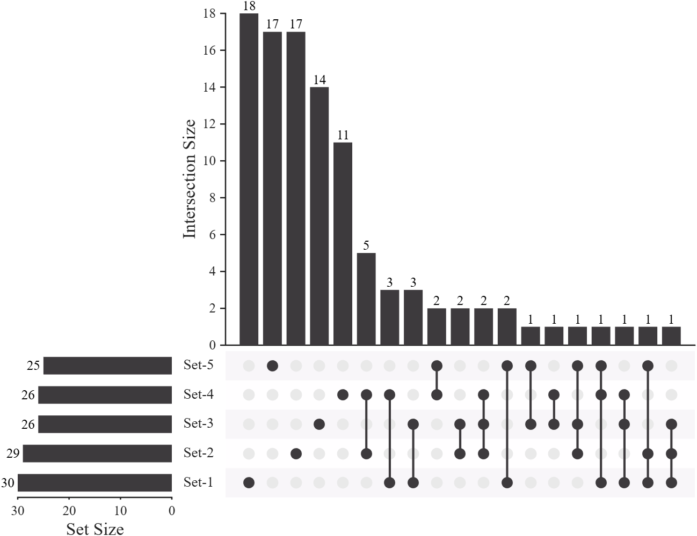
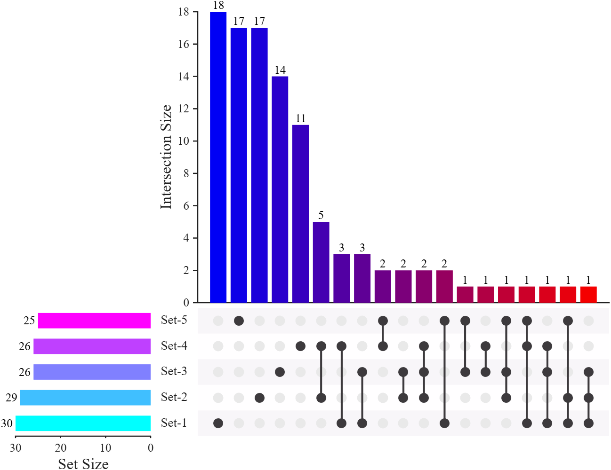
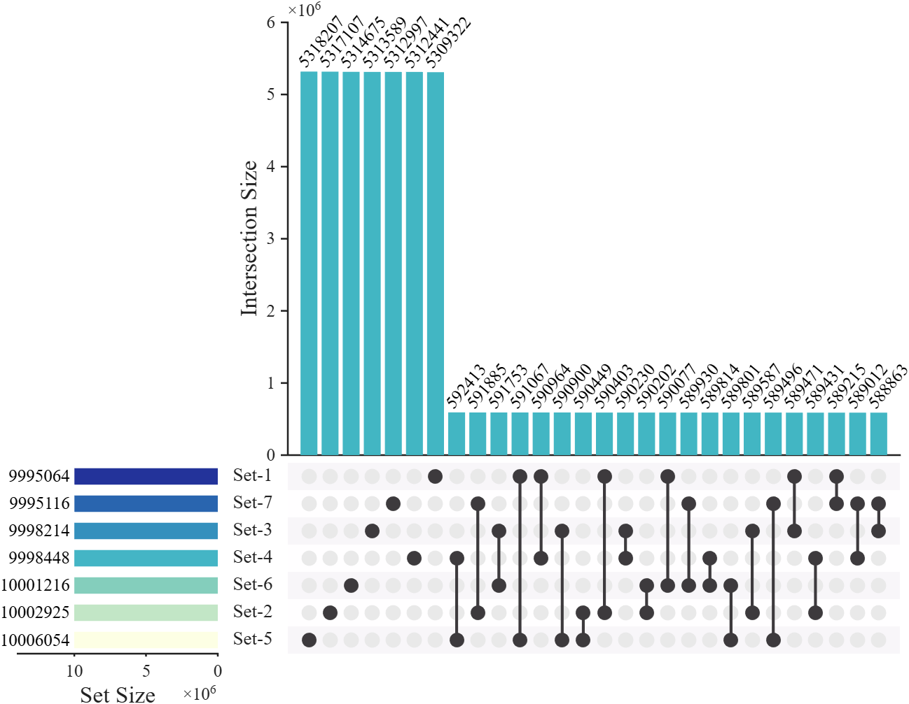
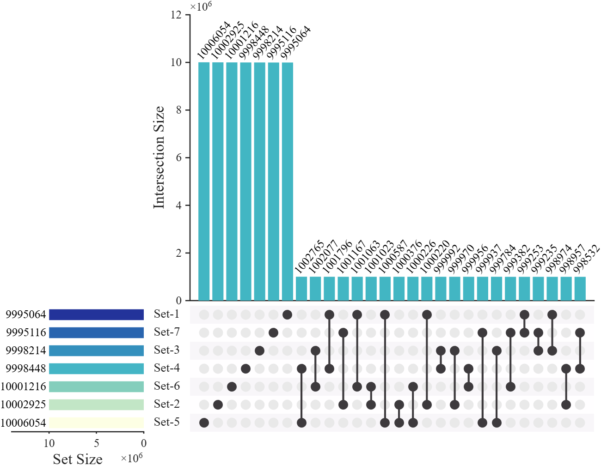
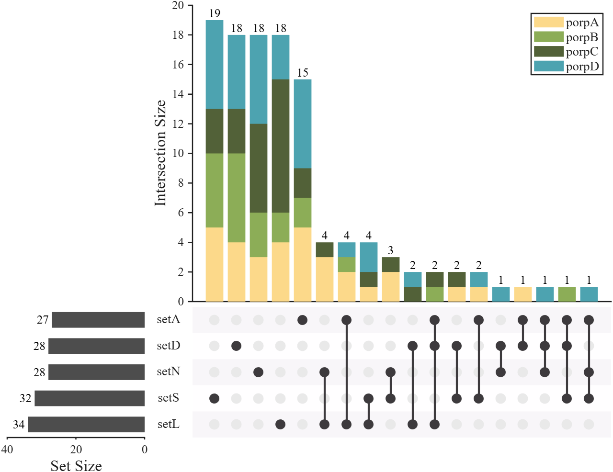
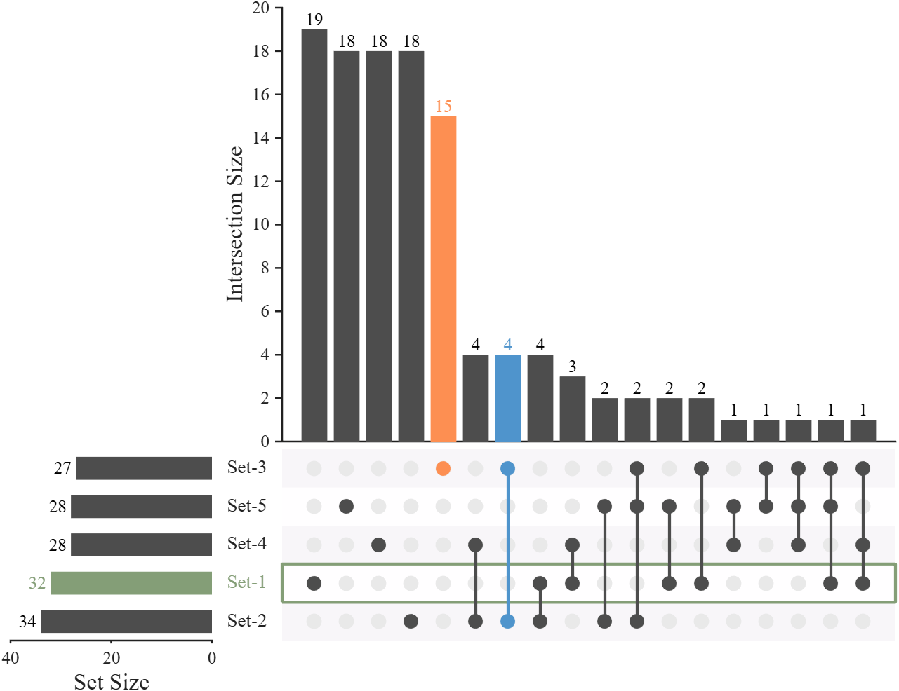
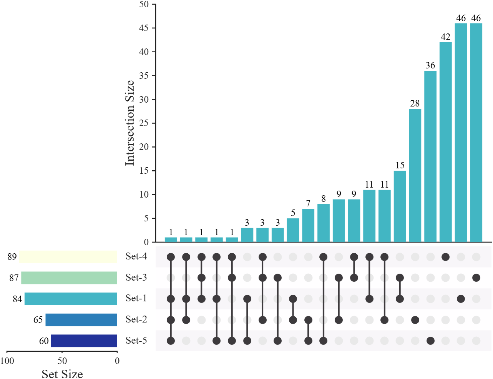

# MATLAB UpSet plot

## 介绍
MATLAB 绘制 UpSet 图

Draw UpSet plot to show set data with more than three Intersections. Supports both 'intersect' and 'distinct' modes and large-scale dataset.
## Basic uasge | UpSet mode: 'distinct'(default)
```matlab
rng(1)
% Define set names (5 categories).
setName = {'RB1','PIK3R1','EGFR','TP53','PTEN'};
% Generate random binary membership matrix (200 samples, 5 sets).
setMat = rand([200, 5]) > 0.85;
% Create UpSet plot object.
USP = UpSetPlot(setMat, 'SetName',setName);
USP.calc();    % Calculate intersection sizes.  
USP.draw();    % Render the UpSet plot.
```

## UpSet mode: 'intersect'
```matlab
rng(1)
setName = {'RB1','PIK3R1','EGFR','TP53','PTEN'};
setMat = rand([200, 5]) > 0.85;
% Create UpSet plot object with 'intersect' mode.
USP = UpSetPlot(setMat, 'SetName',setName, 'Mode','intersect');
USP.calc(); 
USP.draw();
```

## Change colors
```matlab
rng(5)
setMat = rand([200, 5]) > 0.85;
USP = UpSetPlot(setMat);
% Grayscale color scheme
USP.BarColorI = [ 61, 58, 61]./255;
USP.BarColorS = [ 61, 58, 61]./255;
USP.LineColor = [ 61, 58, 61]./255;
% % Alternative color scheme
% USP.BarColorI = [  0,  0,245; 245,  0,  0]./255;
% USP.BarColorS = cool;
% USP.LineColor = [ 61, 58, 61]./255;
USP.calc(); 
USP.draw();
```


## Large dataset (100 million samples, 7 sets)
```matlab
rng(5)
% Generate large sparse binary matrix (100M samples, 7 sets).
setMat = rand([1e8, 7]) > 0.9;
USP = UpSetPlot(setMat);
USP.calc(); 
% Display only top 28 largest intersections to reduce clutter.
USP.draw(28);
% Extend X-axis limit by 40% to accommodate set-size labels.
USP.axS.XLim = USP.axS.XLim.*1.4;
% Rotate intersection-size labels to 50° to reduce label overlap.
for i = 1:length(USP.txtHdlI)
    set(USP.txtHdlI(i), 'Rotation', 50, 'HorizontalAlignment','left')
end
```
distinct:

intersect:


## Stacked bar chart visualization of additional information (distinct mode only)
```matlab
rng(1)
% Define set names (5 categories).
setName = {'setS','setL','setA','setN','setD'};
% Generate random binary membership matrix (200 samples, 5 sets).
setMat = rand([200, 5]) > 0.85;
% Remove samples that do not belong to any set.
setMat = setMat(any(setMat, 2), :);

% Define property-related parameters.
propNum = 4;                                       % Number of property categories.
porpName = {'porpA','porpB','porpC','porpD'};      % Names of property categories.
propList = randi([1, 4], [size(setMat, 1), 1]);    % Random property assignment for each sample (1-4).
propCList = [.99, .85, .54; .55, .68, .34;         % Color List for stacked bar segments (RGB).
             .32, .38, .22; .30, .64, .69;
             .35, .55, .57; .22, .36, .37];

% Create UpSet plot object.
USP = UpSetPlot(setMat, 'SetName',setName);
USP.BarColorS = [.3, .3, .3];
USP.calc();    % Calculate intersection sizes.  
USP.draw();    % Render the UpSet plot.

%% Stacked bar chart visualization of additional information
propMat = zeros([USP.nzNum, propNum]);
for i = 1:USP.nzNum
    for j = 1:propNum
        propMat(i, j) = sum(propList(USP.nzIndex(i) == USP.oriIndex) == j);
    end
end
delete(USP.barHdlI)
% Create stacked bar chart to show property composition within each intersection.
barHdl = bar(USP.axI, propMat, 'stacked', 'EdgeColor','none');
for i = 1:length(barHdl)
    barHdl(i).FaceColor = propCList(i, :);
end
legend(USP.axI, porpName, 'FontSize',13, 'FontName','Times New Roman', 'Direction','normal')
```


## Highlight for bar chart
```matlab
rng(1)
% Define set names (5 categories).
setMat = rand([200, 5]) > 0.85;

% Create UpSet plot object.
USP = UpSetPlot(setMat);

% Grayscale color scheme
USP.BarColorI = [.3, .3, .3];
USP.BarColorS = [.3, .3, .3];
USP.LineColor = [.3, .3, .3];

USP.calc();
USP.draw();


% Highlight for intersection size bar chart
USP.highlightI(7, [79,148,204]./255)
USP.highlightI(5, [253,143,82]./255)

% Highlight for Set size bar chart
USP.highlightS(2, [132,158,119]./255)
```


## Reverse XDir and YDir
```matlab
rng(1)
setMat = rand([500, 5]) > 0.85;

USP = UpSetPlot(setMat);
USP.calc();    
USP.draw(2^5);    

pause(1)
USP.reverseXDir()
USP.reverseYDir()
```


## Acknowledgements
I would like to thank Joris Hooftman for his feedback, in which he noted that UpSet diagrams support an 'intersect' mode and provided relevant code. This greatly inspired my implementation of the 'intersect' mode during the update. I also appreciate his suggestion regarding the need for large-scale dataset visualization and the block-processing solution he proposed, although this approach was not ultimately adopted.
The final implementation adopts a method that directly converts data to decimal numbers for counting, achieving the 'distinct' mode while reducing memory usage.
```matlab
% Convert each sample row to decimal code
decList = 2.^((SetNum - 1) : -1 : 0).';
decCode = sort(SetMat * decList);
% Count occurrences of each combination (distinct mode)
binCount = zeros(2^SetNum - 1, 1);
binCount(unique(decCode)) = diff([0; find([diff(decCode); 1])]);
```
Subsequently, a matrix of all non-empty set combinations fulBool is generated, and the inclusion relationships among these combinations are computed. The count of each combination is then summed with the counts of all its subsets (inclusion * binCount). This is equivalent to treating the non-empty combination matrix as a new dataset and re-computing the size of each combination.
```matlab
% Generate all non-empty set combinations (2^n - 1)
fulBool = dec2bin(1:(2^SetNum - 1)) - '0';
% Inclusion matrix: combination i contains combination j
inclusion = (fulBool * fulBool.') == sum(fulBool, 2);
binCount = inclusion * binCount;
```